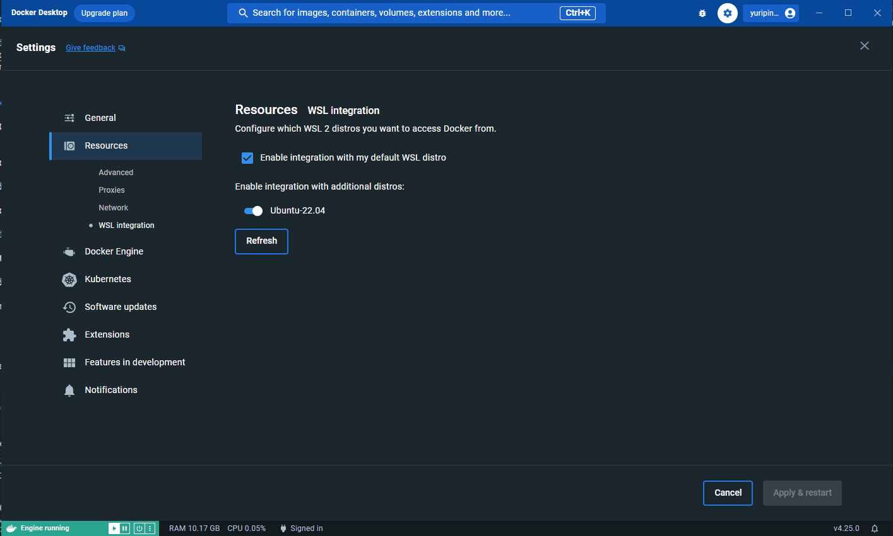
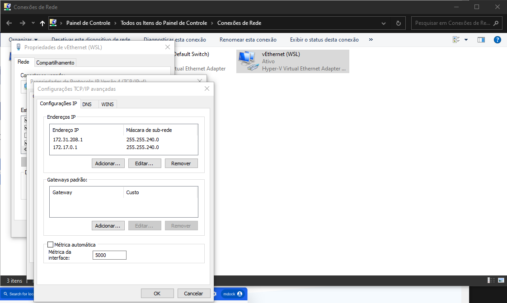

# PokeAPI NestJS Middleware

Este projeto é um middleware construído com NestJS que fornece uma endpoints otimizados para acessar a [Pokedex](https://github.com/yuripinheirot/pokemon-project-front). Ele inclui uma série de características avançadas, desde mapeamentos com class-transformer, sistema de caching até autenticação com Keycloak.

---
### 🎨 Características

- **Mapeamento com Class-transformer**: Converte a saída dos endpoints da PokeAPI para uma forma mais utilizável e otimizada para o middleware.

- **Validação de Dados**: Utiliza o Class Validator para garantir que os dados de entrada sejam corretos antes de processá-los.

- **Sistema de Logging com Interceptors**: Identifica e registra falhas, facilitando a depuração e monitoramento do middleware.

- **Tipagem Forte com TypeScript**: Todo o projeto é escrito em TypeScript, garantindo a segurança e a robustez do código.

- **Testes**: Inclui testes de feature e unitários para assegurar a qualidade e a funcionalidade do middleware.

- **TypeORM com PostgreSQL**: Utiliza TypeORM para integração com um banco de dados PostgreSQL.

- **Sistema de Caching**: Otimiza as requisições e diminui os tempos de carregamento usando Redis como sistema de caching.

- **Autenticação com Keycloak**: Garante a segurança dos dados e das operações ao exigir autenticação via Keycloak.

---
### 🛣️ Rotas

O middleware oferece uma variedade de endpoints para facilitar o acesso aos dados da PokeAPI e à gestão da Pokédex do usuário. Abaixo estão as principais rotas disponíveis:

#### Pokémon

- `GET /pokemon/:nameOrId`:
  - **Descrição**: Consulta informações de um Pokémon específico pelo nome ou ID.
  - **Parâmetros**: `nameOrId` (ID ou nome do Pokémon)
  - **Resposta**: Detalhes do Pokémon solicitado.

- `GET /pokemon`:
  - **Descrição**: Lista todos os Pokémon disponíveis.
  - **Resposta**: Uma lista de Pokémon com informações resumidas.

#### Pokédex

- `GET /pokedex`:
  - **Descrição**: Retorna a Pokédex do usuário autenticado.
  - **Requisitos**: Autenticação via Keycloak.
  - **Resposta**: Uma lista dos Pokémon na Pokédex do usuário.

- `POST /pokedex`:
  - **Descrição**: Adiciona um Pokémon à Pokédex do usuário autenticado.
  - **Requisitos**: Autenticação via Keycloak.
  - **Corpo da Requisição**: Informações do Pokémon a ser adicionado.
  - **Resposta**: Confirmação de adição do Pokémon.

- `DELETE /pokedex`:
  - **Descrição**: Remove um Pokémon da Pokédex do usuário autenticado.
  - **Requisitos**: Autenticação via Keycloak.
  - **Corpo da Requisição**: Informações do Pokémon a ser removido.
  - **Resposta**: Confirmação de remoção do Pokémon.

---
### 🚀 Começando

### Pré-requisitos

- [Docker](https://docs.docker.com/engine/install/)
- [Docker compose](https://docs.docker.com/compose/)
- [Docker Desktop](https://www.docker.com/products/docker-desktop/) (Caso você estiver utilizando Windows)
- [Yarn](https://yarnpkg.com/)
- [Git](https://git-scm.com/)

### Pré-Instalação (Somente para Windows)

Antes de começarmos a instalação, é importante configurar corretamente o ambiente no Windows para o uso do WSL com o Docker. Siga as etapas abaixo:

**Passo 1:** Instale o Docker Desktop para Windows, se ainda não estiver instalado.

**Passo 2:** Configurar a integração do WSL no Docker Desktop:

   - Abra o Docker Desktop e vá para `Settings`.
   - Selecione a guia `Resources` e clique em `WSL Integration`.
   - Certifique-se de que a caixa "Enable integration with my default WSL distro" esteja marcada.
   - Selecione a distribuição WSL que você deseja usar com o Docker e clique em `Apply & Restart`



**Passo 3:** Configurar o adaptador de rede do WSL:

   - Vá para as configurações de adaptadores de rede no Windows.
   - Encontre o adaptador chamado `vEthernet (WSL)`. Clique com o botão direito sobre ele e selecione `Propriedades`.

**Passo 4:** Configurar as propriedades do Protocolo de Internet Versão 4 (IPv4):

   - Na janela de propriedades, selecione o adaptador `Protocolo de Internet Versão 4 (IPv4)` e clique em `Propriedades`.
   - Em seguida, clique em `Avançado`.

   Adicione o IP `172.17.0.1` nas configurações avançadas do Protocolo de Internet Versão 4 (IPv4) da seguinte forma:
   

**Passo 5:** Reinicie o WSL e o Docker Desktop:

   - Feche o Docker Desktop, se estiver aberto.
   - Abra o PowerShell como administrador.
   - Execute os seguintes comandos para reiniciar o WSL:

   ```shell
   wsl --shutdown
   wsl
   ```

### Instalação

1. Clone este repositório:
```shell
git clone https://github.com/yuripinheirot/pokemon-project-back
```

2. Navegue até o diretório do projeto:
```shell
cd pokemon-project-back
```

3. Instale as dependências:
```shell
yarn
```

4. Execute o aplicativo localmente:
```shell
docker compose up app
```


O aplicativo agora estará rodando em [http://172.17.0.1:3003](http://172.17.0.1:3003).

---
### 🛠️ Construído Com

- [NestJS](https://nestjs.com/): Um framework para construção de aplicações server-side eficientes, confiáveis e escaláveis em Node.js.
- [Axios](https://axios-http.com/): Cliente HTTP promissivo para o navegador e Node.js.
- [Class-transformer](https://github.com/typestack/class-transformer): Fornece uma maneira de realizar transformações de objeto para objeto. Utilizado para mapear os endpoints da PokeAPI.
- [Class-validator](https://github.com/typestack/class-validator): Validação e sanitização de classes/objetos em TypeScript/JavaScript.
- [Keycloak-connect](https://www.keycloak.org/): Autenticação robusta através da integração do Keycloak.
- [TypeScript](https://www.typescriptlang.org/): Código fonte do middleware escrito em TypeScript, assegurando robustez e clareza.
- [TypeORM](https://typeorm.io/): ORM para acesso ao PostgreSQL
- [Redis](https://redis.io/): Usado como sistema de cache, através de `cache-manager-redis-store`.
- [Jest](https://jestjs.io/): Framework de testes para JavaScript com foco na simplicidade.

---
### 🔑 Nota Sobre Chaves e Variáveis de Ambiente


No desenvolvimento deste projeto, optou-se por não ocultar chaves de API, variáveis de ambiente e outras informações sensíveis. A razão para essa decisão é que o repositório foi criado com propósitos estritamente didáticos. Em ambientes de produção reais, é essencial que tais informações sejam tratadas com o máximo cuidado, adotando-se ferramentas e práticas de segurança apropriadas.
  

Se alguém estiver considerando adaptar ou usar este projeto em um contexto mais realista ou em um ambiente de produção, **é fortemente recomendado** que implemente medidas de segurança adequadas. Isso inclui, mas não se limita a, o uso de variáveis de ambiente seguras, serviços de gerenciamento de segredos e a prática de nunca comitar informações sensíveis diretamente no repositório.
  

Esta observação é um lembrete da importância das melhores práticas de segurança no desenvolvimento de software e da necessidade constante de proteger informações valiosas e sensíveis.  

--- 
### 📝 Licença 

Este projeto está sob a licença MIT. Veja o arquivo [LICENSE](https://chat.openai.com/c/LICENSE) para mais detalhes.

---
### 💬 Contribuições

Contribuições são sempre bem-vindas! Sinta-se à vontade para abrir uma `issue` ou enviar um `pull request`.